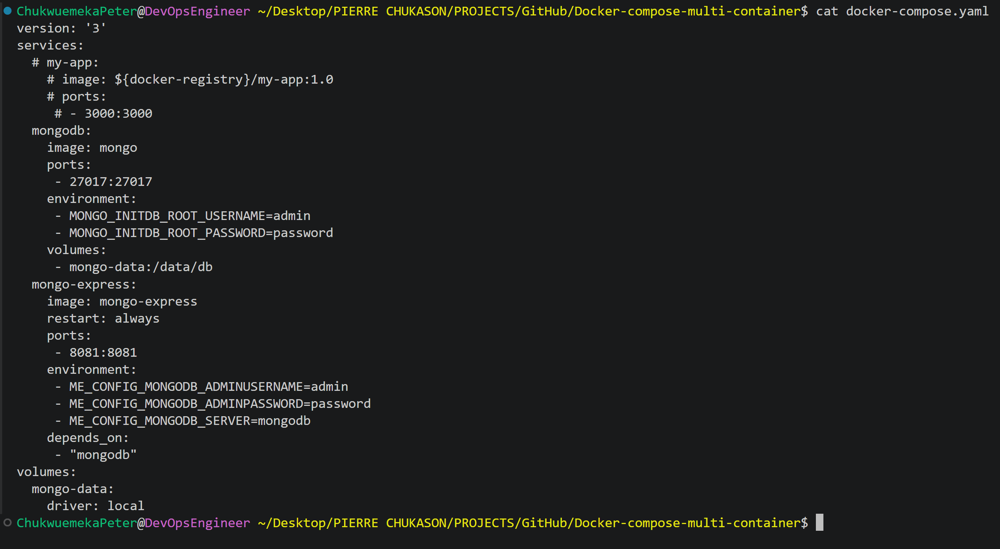
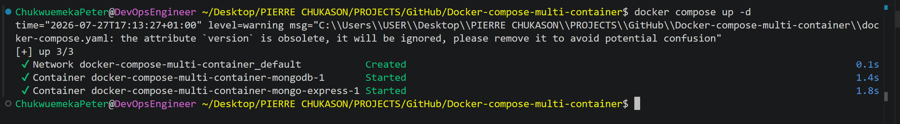
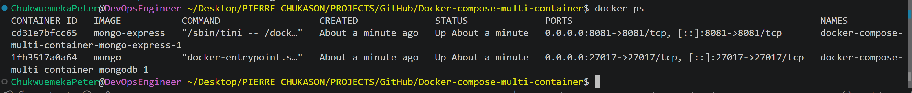
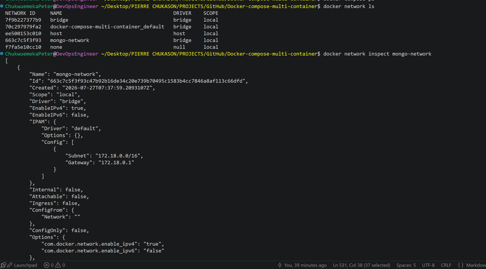
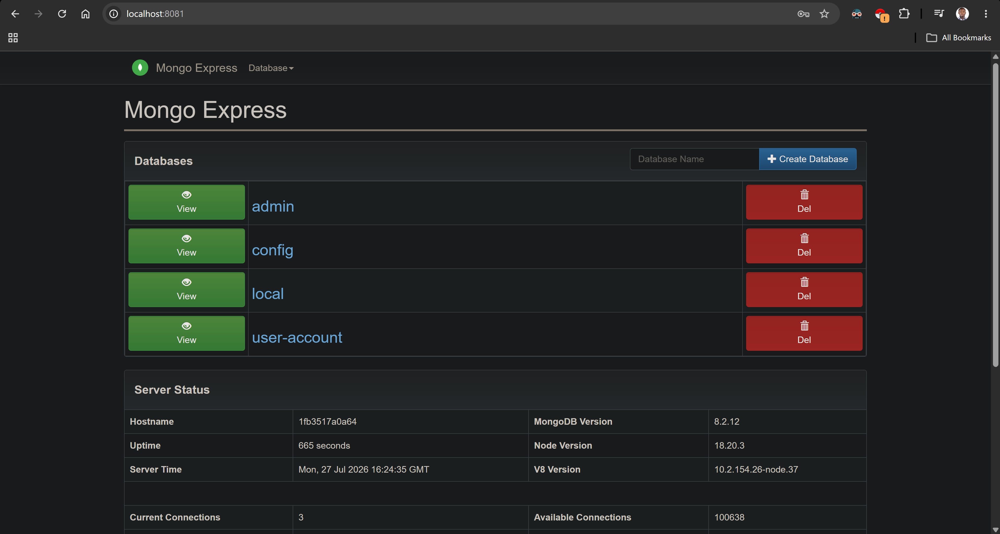
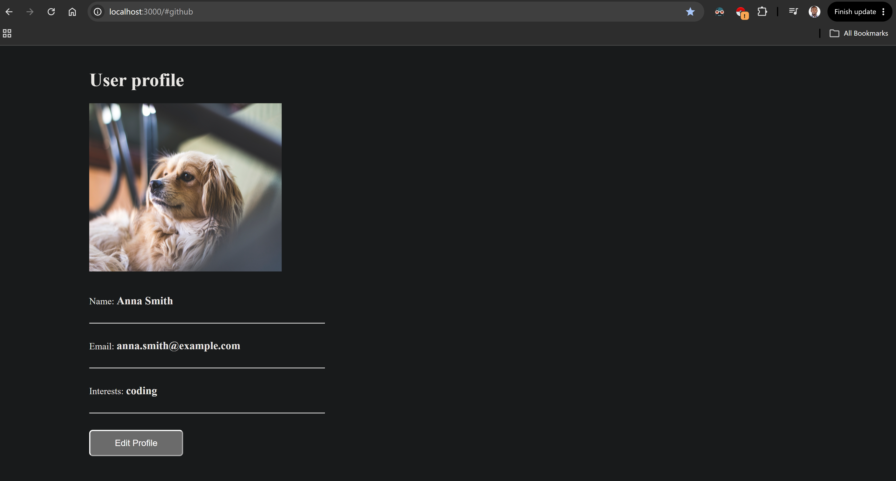
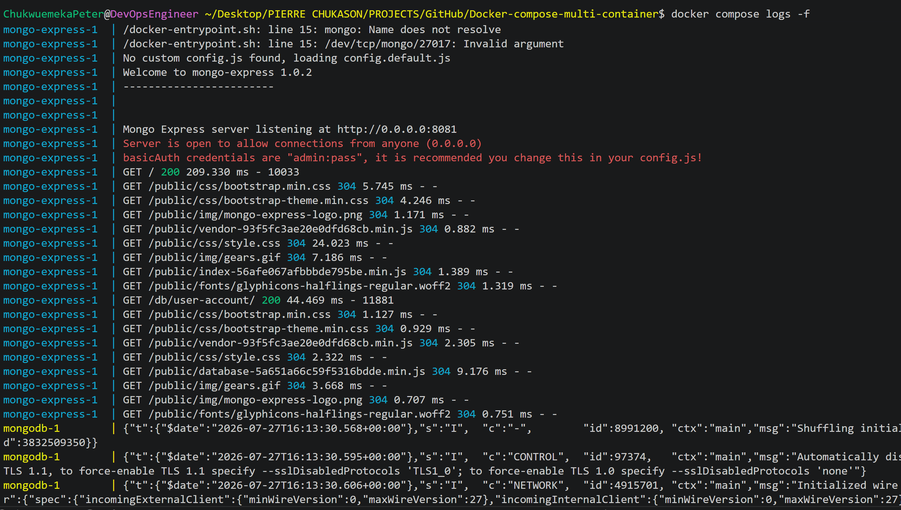

# Docker Compose Multi-Container Application on AWS

<p align="center">


</p>

---

# Project Overview

This project demonstrates how to deploy and manage a multi-container application using Docker Compose on AWS.

Instead of manually creating and managing individual Docker containers, Docker Compose allows multiple related services to be defined in a single configuration file and deployed together as a complete application stack.

The project includes three primary services:

- Node.js Application
- MongoDB Database
- Mongo Express Web Interface

Docker Compose automatically creates a shared network for these services, enabling secure communication using service names rather than manually configured IP addresses.

This repository documents the complete deployment workflow, architecture, Docker Compose configuration, networking concepts, service orchestration, troubleshooting process, and lessons learned while building and managing a multi-container application.

---

# Project Objectives

The objectives of this project were to:

- Understand Docker Compose architecture.
- Deploy multiple services using a single Compose file.
- Configure MongoDB as the application's database.
- Deploy Mongo Express for database management.
- Connect the Node.js application to MongoDB.
- Learn Docker service discovery.
- Understand Docker networking.
- Simplify multi-container deployments.
- Document the complete engineering workflow.

---

# Why Docker Compose?

As applications grow, they often consist of multiple services instead of a single container.

For example:

- Backend API
- Database
- Cache
- Message Queue
- Monitoring Tools
- Reverse Proxy

Managing each service individually with `docker run` quickly becomes difficult and error-prone.

Docker Compose solves this problem by allowing the entire application stack to be described in a single `docker-compose.yml` file. With one command, every required service can be started, stopped, or recreated together.

---

# Project Architecture

This project consists of three containers working together.

```text
                User
                  │
                  ▼
          Web Browser
                  │
                  ▼
        Node.js Application
                  │
                  ▼
             MongoDB
                  ▲
                  │
          Mongo Express
```

All communication between services occurs through the Docker network automatically created by Docker Compose.

---

# Technologies Used

| Technology | Purpose |
|------------|---------|
| Docker | Container Runtime |
| Docker Compose | Multi-container orchestration |
| Node.js | Backend Application |
| MongoDB | NoSQL Database |
| Mongo Express | Database Administration Interface |
| AWS EC2 | Cloud Compute Environment |
| Ubuntu Linux | Operating System |
| Git | Version Control |
| GitHub | Repository Hosting |

---

# Key Skills Demonstrated

This project demonstrates practical experience with:

- Docker Compose
- Multi-container deployments
- Service orchestration
- Docker networking
- Container communication
- MongoDB deployment
- Mongo Express deployment
- Node.js deployment
- AWS EC2
- Infrastructure documentation
- Docker Compose CLI
- Docker troubleshooting
- Linux administration

---

# Architecture Diagram

> Replace the placeholder below after creating your Draw.io diagram.

```text
images/architecture.png
```

<p align="center">


</p>

---

# High-Level Workflow

```text
Developer
      │
      ▼
GitHub Repository
      │
      ▼
AWS EC2 Instance
      │
      ▼
Docker Compose
      │
 ┌────┼───────────────┐
 ▼    ▼               ▼
Node MongoDB   Mongo Express
 │      │              │
 └──────┴──────────────┘
        Docker Network
             │
             ▼
       Web Browser
```

---

# Repository Structure

```text
Docker-compose-multi-container
│
├── README.md
├── LICENSE
├── .gitignore
│
├── docker-compose.yml
│
├── app/
│   └── Node.js Application
│
├── architecture/
│   └── architecture.drawio
│
├── docs/
│   ├── setup.md
│   ├── troubleshooting.md
│   └── lessons-learned.md
│
├── images/
│   ├── architecture.png
│   ├── compose-file.png
│   ├── compose-up.png
│   ├── running-containers.png
│   ├── mongo-express.png
│   ├── mongodb.png
│   ├── node-app.png
│   ├── browser.png
│   ├── docker-network.png
│   └── docker-logs.png
│
├── commands.md
│
└── video-script.md
```

---

# Learning Outcomes

By completing this project, I gained practical experience in:

- Managing multiple containers as a single application stack.
- Defining infrastructure using a Docker Compose configuration.
- Understanding Docker service discovery.
- Configuring container networking.
- Connecting backend applications to databases.
- Simplifying deployment through automation.
- Deploying containerized applications on AWS.
- Documenting engineering workflows for reproducibility.

---

---

# Prerequisites

Before deploying the multi-container application, ensure the following requirements are available.

| Requirement | Description |
|-------------|-------------|
| AWS Account | Cloud environment for hosting the application |
| Amazon EC2 Instance | Linux virtual machine |
| Ubuntu Linux | Operating System |
| Docker Engine | Container Runtime |
| Docker Compose | Multi-container orchestration tool |
| Git | Version Control |
| SSH Client | Remote server access |
| Web Browser | Accessing the application and Mongo Express |

---

# Environment Details

The project was implemented using the following environment.

| Component | Value |
|-----------|-------|
| Cloud Provider | Amazon Web Services (AWS) |
| Compute Service | Amazon EC2 |
| Operating System | Ubuntu Linux |
| Container Runtime | Docker Engine |
| Orchestration Tool | Docker Compose |
| Backend Application | Node.js |
| Database | MongoDB |
| Database UI | Mongo Express |
| Version Control | Git |
| Repository Hosting | GitHub |

---

# Multi-Container Architecture

Unlike a single-container deployment, this project consists of multiple services working together as one application stack.

Each service has a specific responsibility.

```text
                Web Browser
                     │
                     ▼
            Node.js Application
                     │
                     ▼
                 MongoDB
                     ▲
                     │
             Mongo Express

          Docker Compose Network
```

Docker Compose automatically creates a private network that allows these services to communicate securely using service names.

---

# Why Docker Compose?

Running several containers individually using multiple `docker run` commands quickly becomes difficult to manage.

Docker Compose addresses this by allowing all services to be declared in a single YAML configuration file.

Benefits include:

- Single command deployment
- Automatic networking
- Service discovery
- Centralized configuration
- Easier maintenance
- Simplified troubleshooting
- Improved reproducibility

---

# Understanding docker-compose.yml

The `docker-compose.yml` file defines the entire application stack.

Typical sections include:

- Services
- Networks
- Volumes
- Environment Variables
- Port Mappings
- Restart Policies
- Container Names

Each service is described declaratively, allowing Docker Compose to create and manage the containers automatically.

---

# Application Services

## Node.js Application

Responsibilities:

- Serves application requests
- Connects to MongoDB
- Exposes the application through a browser

---

## MongoDB

Responsibilities:

- Stores application data
- Persists collections and documents
- Receives requests from the Node.js application

---

## Mongo Express

Responsibilities:

- Provides a web interface
- Allows database inspection
- Enables collection management
- Simplifies testing and verification

---

# Project Workflow

The deployment followed this workflow.

```text
Clone Repository
        │
        ▼
Review docker-compose.yml
        │
        ▼
Start Docker Compose
        │
        ▼
Create Docker Network
        │
        ▼
Start MongoDB
        │
        ▼
Start Mongo Express
        │
        ▼
Start Node.js Application
        │
        ▼
Verify Containers
        │
        ▼
Access Browser
        │
        ▼
Test Database Connectivity
```

---

# Clone the Repository

Clone the repository onto the EC2 instance.

```bash
git clone https://github.com/Chukwuemeka-Peter-Eze/Docker-compose-multi-container.git
```

Navigate into the project directory.

```bash
cd Docker-compose-multi-container
```

---

# Verify the Project Structure

Before deployment, verify that the repository contains the required files.

Example:

```text
Docker-compose-multi-container/

docker-compose.yml

README.md

Node.js Application

images/

docs/
```

---

# Review the Compose File

Inspect the configuration before deployment.

```bash
cat docker-compose.yml
```

The Compose file should define:

- Node.js service
- MongoDB service
- Mongo Express service
- Port mappings
- Environment variables
- Docker network

---

## Screenshot Placeholder — Docker Compose File

```text
images/compose-file.png
```

<p align="center">



</p>

---

# Deploy the Application Stack

Start all services.

```bash
docker compose up -d
```

Docker Compose automatically performs the following operations:

- Reads the Compose configuration
- Creates the Docker network
- Pulls required images (if needed)
- Creates all containers
- Connects services to the shared network
- Starts every service in detached mode

Unlike managing containers individually, a single command deploys the complete application stack.

---

## Screenshot Placeholder — Docker Compose Up

```text
images/compose-up.png
```

<p align="center">



</p>

---

# Verify Running Services

Display the running containers.

```bash
docker ps
```

Expected services include:

- Node.js Application
- MongoDB
- Mongo Express

Verify:

- All containers are running
- Port mappings are correct
- Container names are accurate
- No unexpected restarts are occurring

---

## Screenshot Placeholder — Running Containers

```text
images/running-containers.png
```

<p align="center">



</p>

---

# Verify Docker Network

Docker Compose automatically creates a dedicated bridge network for the application.

Display available networks.

```bash
docker network ls
```

Inspect the project network.

```bash
docker network inspect <network-name>
```

The inspection output should confirm that the Node.js, MongoDB, and Mongo Express containers are attached to the same network.

---

## Screenshot Placeholder — Docker Network

```text
images/docker-network.png
```

<p align="center">



</p>

---

# Access Mongo Express

Open your browser and navigate to the Mongo Express interface using the mapped host port.

From here you can:

- Browse databases
- View collections
- Verify connectivity
- Confirm that MongoDB is operational

---

## Screenshot Placeholder — Mongo Express

```text
images/mongo-express.png
```

<p align="center">



</p>

---

# Access the Node.js Application

Open the Node.js application using your EC2 public IP address and the configured application port.

Successful access confirms that:

- Docker Compose deployed the application correctly.
- The Node.js service is operational.
- Networking between services is functioning.
- The application can communicate with MongoDB.

---

## Screenshot Placeholder — Node.js Application

```text
images/node-app.png
```

<p align="center">



</p>

---

# Deployment Summary

At this stage, the following objectives have been successfully completed:

- Docker Compose configuration reviewed
- Multi-container application stack deployed
- Shared Docker network created
- MongoDB service started
- Mongo Express service started
- Node.js application started
- Container communication verified
- Browser access confirmed

This deployment demonstrates how Docker Compose simplifies the management of interconnected services by treating them as a single, cohesive application.

---

---

# Understanding Docker Compose Services

A Docker Compose application is organized around **services**.

Each service represents a container that performs a specific responsibility within the application.

In this project, three services work together to provide a complete application stack.

| Service | Responsibility |
|----------|----------------|
| Node.js | Backend application |
| MongoDB | Database |
| Mongo Express | Database administration interface |

Each service is isolated in its own container but communicates with the others through the Docker Compose network.

---

# Service Dependencies

The relationship between the services can be visualized as follows.

```text
             User
               │
               ▼
        Node.js Application
               │
               ▼
            MongoDB
               ▲
               │
        Mongo Express
```

The Node.js application stores and retrieves data from MongoDB, while Mongo Express provides a graphical interface for inspecting and managing the database.

---

# Docker Compose Networking

One of Docker Compose's most valuable features is automatic networking.

When the application stack is started, Docker Compose automatically:

- Creates a dedicated bridge network
- Connects every service to that network
- Configures internal DNS
- Enables secure communication between containers

Because of this, containers communicate using service names instead of IP addresses.

For example:

```text
Node.js
     │
     ▼
mongodb:27017
```

Instead of using changing IP addresses, the application can simply reference the MongoDB service by its service name.

This makes deployments more portable and easier to maintain.

---

# Service Discovery

Docker Compose includes built-in service discovery.

For example:

```yaml
services:
  mongodb:

  node-app:
```

The Node.js application can connect to MongoDB using:

```text
mongodb
```

rather than:

```text
172.18.0.2
```

This eliminates the need to manually manage container IP addresses.

---

# Environment Variables

Environment variables provide configuration values to containers without modifying application code.

Examples include:

- Database usernames
- Database passwords
- Database names
- Application ports
- Runtime configuration

Separating configuration from application logic improves security, portability, and maintainability.

---

# Container Lifecycle Management

Docker Compose manages the entire lifecycle of the application stack.

Start all services.

```bash
docker compose up -d
```

Stop all services.

```bash
docker compose down
```

Restart the application stack.

```bash
docker compose restart
```

These commands eliminate the need to start or stop containers individually.

---

# Viewing Running Services

Display running containers.

```bash
docker ps
```

Display Docker Compose services.

```bash
docker compose ps
```

Verify that:

- All services are running
- Container names are correct
- Port mappings are correct
- No unexpected restarts are occurring

---

# Viewing Logs

Display logs for all services.

```bash
docker compose logs
```

Display logs for a specific service.

```bash
docker compose logs mongodb

docker compose logs mongo-express

docker compose logs node-app
```

Follow logs in real time.

```bash
docker compose logs -f
```

Logs are useful for:

- Startup verification
- Runtime monitoring
- Error diagnosis
- Troubleshooting

---

## Screenshot Placeholder — Logs

```text
images/docker-logs.png
```

<p align="center">



</p>

---

# Accessing Running Containers

Open an interactive shell inside a container.

Node.js

```bash
docker exec -it node-app sh
```

MongoDB

```bash
docker exec -it mongodb bash
```

Mongo Express

```bash
docker exec -it mongo-express sh
```

Interactive access helps with:

- Inspecting files
- Debugging applications
- Verifying installed packages
- Running diagnostic commands

---

# Inspecting Docker Resources

Inspect a container.

```bash
docker inspect node-app
```

Inspect the Docker network.

```bash
docker network inspect <network-name>
```

List Docker volumes.

```bash
docker volume ls
```

Inspect a volume.

```bash
docker volume inspect <volume-name>
```

These commands provide detailed information about container configuration, networking, and persistent storage.

---

# Screenshot Gallery

Replace each placeholder with the corresponding screenshot from your implementation.

| Activity | Screenshot |
|----------|------------|
| Docker Compose Configuration | `images/compose-file.png` |
| Deploying the Stack | `images/compose-up.png` |
| Running Containers | `images/running-containers.png` |
| Docker Network | `images/docker-network.png` |
| MongoDB Running | `images/mongodb.png` |
| Mongo Express Interface | `images/mongo-express.png` |
| Node.js Application | `images/node-app.png` |
| Browser Verification | `images/browser.png` |
| Docker Logs | `images/docker-logs.png` |

---

# Challenges Encountered

During implementation, several common issues were identified and resolved.

## Containers Failed to Start

Possible causes:

- Incorrect service configuration
- Missing environment variables
- Image download failures

Resolution:

- Reviewed the Compose configuration.
- Verified environment variables.
- Restarted the application stack.

---

## Service Communication Problems

Possible causes:

- Incorrect service names
- Containers not attached to the same network
- Application configuration errors

Resolution:

- Verified Docker network.
- Confirmed service names.
- Checked application configuration.

---

## Port Conflicts

Possible causes:

- Another application already using the mapped port.

Resolution:

- Stopped the conflicting service or changed the host port mapping.

---

## Database Connection Errors

Possible causes:

- MongoDB not fully initialized.
- Incorrect connection string.
- Invalid credentials.

Resolution:

- Reviewed logs.
- Verified environment variables.
- Confirmed service startup order.

---

# Docker Compose Best Practices

The following practices were applied throughout this project.

- Keep each service focused on a single responsibility.
- Use descriptive service names.
- Store configuration in environment variables.
- Document exposed ports.
- Verify services after deployment.
- Review logs regularly.
- Use Docker Compose for local development and testing.
- Keep the Compose file under version control.
- Organize project documentation for reproducibility.

---

# Future Improvements

Potential enhancements include:

- Adding persistent Docker volumes for MongoDB.
- Introducing health checks for each service.
- Using Docker Compose profiles for different environments.
- Adding a reverse proxy (such as Nginx).
- Integrating automated testing.
- Deploying the stack through a CI/CD pipeline.
- Publishing custom images to a private registry.
- Migrating the application to Kubernetes for orchestration at scale.

---

# References

Useful resources for further learning:

- Docker Documentation
- Docker Compose Documentation
- MongoDB Documentation
- Mongo Express Documentation
- Node.js Documentation
- AWS EC2 Documentation

---

# Project Summary

This project demonstrates how Docker Compose simplifies the deployment and management of a multi-container application by defining all required services in a single configuration file. Through automatic networking, service discovery, and centralized orchestration, Docker Compose provides a repeatable and maintainable workflow for running interconnected services.

By deploying a Node.js application, MongoDB database, and Mongo Express interface on AWS, this project reinforces practical skills in container orchestration, networking, troubleshooting, and infrastructure documentation—core competencies for modern DevOps and cloud engineering.

---

# Connect With Me

If you found this repository helpful or would like to discuss Docker, DevOps, Cloud Engineering, or Infrastructure Automation, feel free to connect.

- **GitHub:** https://github.com/Chukwuemeka-Peter-Eze
- **LinkedIn:** https://www.linkedin.com/in/chukwuemekapetereze/
- **Notion:** https://lumpy-bubble-7b0.notion.site/Containers-with-Docker-3a546a96f97480a88041ff2ff82a6b5f?source=copy_link

If you found this repository useful, consider giving it a ⭐ to support the project.

---
