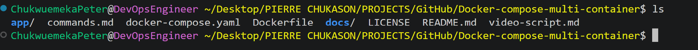
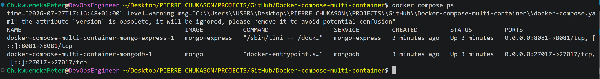
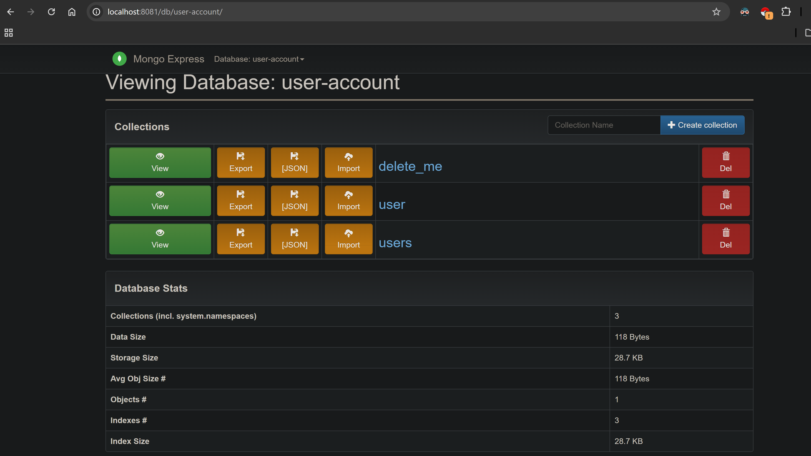

# Docker Compose Multi-Container Application

<p align="center">


</p>

---

# Project Overview

This repository documents the deployment and management of a **multi-container application** using **Docker Compose**.

The project consists of three independent services that work together as a single application stack:

- Node.js Application
- MongoDB Database
- Mongo Express Web Interface

Rather than creating and managing each container individually with multiple `docker run` commands, Docker Compose allows the entire application stack to be defined declaratively in a single `docker-compose.yml` file.

With a single command, Docker Compose automatically:

- Creates the required Docker network
- Pulls required images
- Creates each container
- Configures networking between services
- Starts every service
- Simplifies application lifecycle management

This project was implemented and tested entirely on a **local development machine** using Docker Desktop and Docker Compose.

---

## Project Highlights

- Deployed a three-service application using Docker Compose.
- Connected containers through an isolated Docker network.
- Configured inter-service communication using service discovery.
- Verified application functionality through browser-based testing.
- Documented the complete deployment workflow.

---

## Project Information

| Category | Details |
|----------|---------|
| Project | Docker Compose Multi-Container Application |
| Project Type | Local Development |
| Architecture | Multi-Container |
| Runtime | Docker Engine |
| Orchestration | Docker Compose |
| Backend | Node.js |
| Database | MongoDB |
| Database UI | Mongo Express |
| Platform | Local Machine |
| Status | Completed |

---

# Project Objectives

The primary objectives of this project were to:

- Understand Docker Compose architecture.
- Deploy multiple containers using a single configuration file.
- Learn how services communicate within a Docker network.
- Deploy a Node.js application using Docker Compose.
- Deploy MongoDB as the application's database.
- Deploy Mongo Express for database administration.
- Configure environment variables.
- Understand Docker service discovery.
- Practice container lifecycle management.
- Document the complete engineering workflow.

---

## Features

- Multi-container deployment
- Automatic service discovery
- Docker networking
- Node.js backend
- MongoDB database
- Mongo Express interface
- Environment variable configuration
- Simple application lifecycle management

---

# Why Docker Compose?

Modern applications rarely consist of a single container.

A typical application may include:

- Backend API
- Database
- Cache
- Message Queue
- Reverse Proxy
- Monitoring Tools

Managing every service individually quickly becomes difficult.

Docker Compose simplifies this process by allowing all related services to be described in one YAML configuration file.

Instead of running multiple Docker commands manually, the complete application can be started using:

```bash
docker compose up -d
```

Docker Compose automatically provisions and manages every service required by the application.

---

# Project Architecture

The application consists of three containers that communicate through a Docker Compose network.

```text
                User
                  │
                  ▼
          Web Browser
                  │
                  ▼
        Node.js Application
                  │
                  ▼
             MongoDB
                  ▲
                  │
          Mongo Express
```

Docker Compose automatically creates an isolated bridge network, allowing services to communicate securely using their service names.

---

# Technologies Used

| Technology | Purpose |
|------------|---------|
| Docker Engine | Container Runtime |
| Docker Compose | Multi-container Orchestration |
| Node.js | Backend Application |
| MongoDB | NoSQL Database |
| Mongo Express | Database Administration Interface |
| Git | Version Control |
| GitHub | Repository Hosting |
| Linux | Development Environment |

---

# Key Skills Demonstrated

This project demonstrates practical experience with:

- Docker Compose
- Multi-container deployments
- Docker networking
- Container communication
- Service discovery
- Node.js deployment
- MongoDB deployment
- Mongo Express deployment
- Environment variable management
- Docker CLI
- Docker Compose CLI
- Troubleshooting containerized applications
- Infrastructure documentation

---

# Repository Structure

```text
Docker-compose-multi-container
│
├── README.md
├── LICENSE
├── .gitignore
│
├── docker-compose.yml
│
├── app/
│   └── Node.js Application
│
├── docs/
│   ├── setup.md
│   ├── networking.md
|   |── docker-compose-explained.md
|   |── environmental-variables.md
|   |── service-discovery.md
│   ├── troubleshooting.md
│   └── lessons-learned.md
│
├── images/
│   ├── architecture.png
│   ├── compose-file.png
│   ├── compose-up.png
│   ├── running-containers.png
│   ├── docker-network.png
│   ├── mongodb.png
│   ├── mongo-express.png
│   ├── node-app.png
│   ├── browser.png
│   └── docker-logs.png
│
├── commands.md
│
└── video-script.md
```

---

# Prerequisites

Before running this project, ensure the following software is installed on your local machine.

| Requirement | Purpose |
|-------------|---------|
| Docker Desktop (or Docker Engine) | Container Runtime |
| Docker Compose | Multi-container orchestration |
| Git | Version Control |
| Visual Studio Code (Optional) | Code Editor |
| Web Browser | Accessing the application |

---

# Development Environment

This project was completed using the following environment.

| Component | Value |
|-----------|-------|
| Development Environment | Local Machine |
| Container Runtime | Docker Engine |
| Orchestration Tool | Docker Compose |
| Backend Application | Node.js |
| Database | MongoDB |
| Database Administration | Mongo Express |
| Version Control | Git |
| Repository Hosting | GitHub |

---

# High-Level Workflow

The following diagram illustrates the overall deployment workflow.

```text
Developer
     │
     ▼
Clone Repository
     │
     ▼
Review docker-compose.yml
     │
     ▼
Docker Compose
     │
 ┌───┼──────────────┐
 ▼   ▼              ▼
Node MongoDB   Mongo Express
 │      │             │
 └──────┴─────────────┘
      Docker Network
             │
             ▼
      Web Browser
```

---

# Learning Outcomes

By completing this project, I gained hands-on experience with:

- Building multi-container applications.
- Managing services using Docker Compose.
- Configuring Docker networking.
- Understanding service discovery.
- Connecting backend applications to databases.
- Managing environment variables.
- Verifying container communication.
- Troubleshooting Docker Compose deployments.
- Documenting engineering workflows for reproducibility.

---

# Clone the Repository

Clone the repository to your local machine.

```bash
git clone https://github.com/Chukwuemeka-Peter-Eze/Docker-compose-multi-container.git
```

Navigate into the project directory.

```bash
cd Docker-compose-multi-container
```

---

# Verify the Project Structure

Before deploying the application, verify that the repository contains the required project files.

Run:

```bash
ls
```

You should see files similar to:

```text
README.md
docker-compose.yml
app/
images/
docs/
architecture/
LICENSE
.gitignore
```

---

## Image: Project Structure

```text
images/project-structure.png
```

<p align="center">



</p>

---

# Review the Docker Compose Configuration

Before starting the application stack, inspect the Docker Compose configuration file.

```bash
cat docker-compose.yaml
```

The configuration file defines the complete application stack, including:

- Application services
- Docker images
- Port mappings
- Environment variables
- Networks
- Restart policies

Understanding the Compose file before deployment helps verify that each service is configured correctly.

---

## Image: Docker Compose Configuration

```text
images/compose-file.png
```

<p align="center">


</p>

---

# Deploy the Multi-Container Application

Start the complete application stack.

```bash
docker compose up -d
```

Docker Compose automatically performs the following tasks:

- Reads the `docker-compose.yml` file
- Pulls required images (if not already available)
- Creates the application network
- Creates each container
- Configures networking
- Starts every service in detached mode

Using Docker Compose, the complete application is deployed with a single command.

---

## Image: Docker Compose Up

```text
images/compose-up.png
```

<p align="center">


</p>

---

# Verify Running Containers

List all running containers.

```bash
docker ps
```

Verify that the following containers are running:

- Node.js Application
- MongoDB
- Mongo Express

Confirm that:

- All containers are in the **Up** state.
- Port mappings are correct.
- Container names match the Docker Compose configuration.
- No unexpected restarts are occurring.

---

## Image: Running Containers

```text
images/running-containers.png
```

<p align="center">


</p>

---

# Verify Docker Compose Services

Display all services managed by Docker Compose.

```bash
docker compose ps
```

This command provides additional information such as:

- Service names
- Current status
- Published ports
- Container names

---

## Image: Docker Compose Services

```text
images/compose-ps.png
```

<p align="center">



</p>

---

# Verify Docker Networks

List all Docker networks.

```bash
docker network ls
```

Docker Compose reads the configuration file, provisions the required resources, creates the containers, and starts the complete application stack.

---

Inspect the network.

```bash
docker network inspect <network-name>
```

Replace `<network-name>` with your actual Docker Compose network name.

Verify that all application containers are attached to the same network.

Expected containers include:

- Node.js
- MongoDB
- Mongo Express

This shared network enables the services to communicate using their service names instead of IP addresses.

---

## Image: Docker Network

```text
images/docker-network.png
```

<p align="center">


</p>

---

# Access the Node.js Application

Open a web browser and navigate to the application.

Example:

```text
http://localhost:3000
```

Successful access confirms that:

- The Node.js container is running.
- Port mapping is functioning correctly.
- The application is accessible from the host machine.
- Docker Compose deployed the application successfully.

---

## Image: Node.js Application

```text
images/node-app.png
```

<p align="center">


</p>

---

# Access Mongo Express

Open the Mongo Express web interface.

Example:

```text
http://localhost:8081
```

From the Mongo Express dashboard, verify that:

- MongoDB is running.
- The application successfully connected to the database.
- Collections and databases are visible.

---

## Image: Mongo Express

```text
images/mongo-express.png
```

<p align="center">


</p>

---

# Verify Browser Access

Open both the Node.js application and Mongo Express in your browser to confirm that every service in the application stack is functioning correctly.

Successful verification demonstrates that:

- Docker Compose deployed all services successfully.
- Networking between containers is operational.
- Port mappings are correctly configured.
- The application stack is fully functional.

---

## Image: Browser Verification

```text
images/browser.png
```

<p align="center">



</p>

---

# Deployment Summary

At this stage, the following objectives have been successfully completed:

- Repository cloned successfully.
- Docker Compose configuration reviewed.
- Multi-container application deployed.
- Docker network created automatically.
- Node.js application started.
- MongoDB database started.
- Mongo Express started.
- Container networking verified.
- Browser access confirmed.
- Application stack validated.

The project is now fully operational and ready for further inspection, troubleshooting, and lifecycle management using Docker Compose.

---

# Understanding the Docker Compose Configuration

The `docker-compose.yml` file is the heart of this project. It defines the complete application stack in a declarative format, allowing Docker Compose to create and manage all required services automatically.

Instead of manually creating individual containers with multiple `docker run` commands, Docker Compose uses a single YAML file to describe how the application should be deployed.

A typical Docker Compose configuration includes:

- Services
- Docker images
- Port mappings
- Environment variables
- Networks
- Volumes (optional)
- Restart policies

This approach makes deployments consistent, repeatable, and easier to maintain.

---

# Application Services

This project consists of three services that work together as a complete application stack.

| Service | Purpose |
|----------|---------|
| Node.js | Backend application |
| MongoDB | NoSQL database |
| Mongo Express | Web-based MongoDB administration interface |

Each service runs inside its own container while communicating with the others through Docker Compose's automatically created network.

---

# Service Responsibilities

## Node.js Application

The Node.js container is responsible for:

- Serving application requests
- Processing application logic
- Connecting to MongoDB
- Returning responses to users

---

## MongoDB

MongoDB serves as the application's database.

Responsibilities include:

- Storing application data
- Managing collections and documents
- Responding to database queries
- Persisting application information

---

## Mongo Express

Mongo Express provides a browser-based interface for MongoDB.

It allows developers to:

- Browse databases
- View collections
- Inspect stored documents
- Verify database connectivity
- Simplify testing during development

---

# How the Services Communicate

Although each service runs in a separate container, they function as one application because Docker Compose automatically connects them to the same network.

```text
Browser
    │
    ▼
Node.js
    │
    ▼
MongoDB
    ▲
    │
Mongo Express
```

This architecture keeps each service isolated while allowing secure communication between containers.

---

# Docker Compose Networking

One of Docker Compose's most powerful features is automatic networking.

When the application starts, Docker Compose automatically:

- Creates a dedicated bridge network
- Connects every service to that network
- Configures internal DNS resolution
- Enables communication using service names

No manual network configuration is required.

---

# Service Discovery

Docker Compose includes built-in service discovery.

Instead of connecting to another container using an IP address, containers communicate using their service names.

For example, the Node.js application connects to MongoDB using:

```text
mongodb
```

instead of:

```text
172.18.0.5
```

Because Docker Compose manages DNS resolution automatically, service names remain consistent even if container IP addresses change.

This improves portability and simplifies application configuration.

---

# Environment Variables

Environment variables provide configuration values to containers without requiring changes to the application source code.

Common examples include:

- Database username
- Database password
- Database name
- Application port
- Runtime configuration

Using environment variables helps separate configuration from application logic, making deployments more secure and easier to manage.

---

# Container Lifecycle Management

Docker Compose manages the complete lifecycle of the application stack.

Start all services:

```bash
docker compose up -d
```

Stop all services:

```bash
docker compose down
```

Restart the application stack:

```bash
docker compose restart
```

Start a specific service:

```bash
docker compose start mongodb
```

Stop a specific service:

```bash
docker compose stop mongodb
```

These commands simplify administration by allowing the entire application or individual services to be managed from a single interface.

---

# Viewing Running Services

Display running containers.

```bash
docker ps
```

Display services managed by Docker Compose.

```bash
docker compose ps
```

These commands help verify:

- Running status
- Published ports
- Container names
- Service health

---

# Viewing Logs

Logs provide valuable information about container startup, runtime activity, and troubleshooting.

Display logs for every service.

```bash
docker compose logs
```

Display logs for a specific service.

```bash
docker compose logs node-app

docker compose logs mongodb

docker compose logs mongo-express
```

Follow logs in real time.

```bash
docker compose logs -f
```

Logs are commonly used to:

- Verify successful startup
- Diagnose application errors
- Monitor service activity
- Troubleshoot connectivity issues

---

## Image: Docker Logs

```text
images/docker-logs.png
```

<p align="center">


</p>

---

# Accessing Running Containers

Sometimes it is necessary to open an interactive shell inside a running container for inspection or troubleshooting.

Node.js container:

```bash
docker exec -it node-app sh
```

MongoDB container:

```bash
docker exec -it mongodb bash
```

Mongo Express container:

```bash
docker exec -it mongo-express sh
```

Interactive container access is useful for:

- Inspecting files
- Running diagnostic commands
- Verifying installed software
- Debugging application behavior

---

# Inspecting Docker Resources

Docker provides inspection commands that display detailed configuration information.

Inspect the Node.js container.

```bash
docker inspect node-app
```

Inspect the Docker network.

```bash
docker network inspect <network-name>
```

List available Docker volumes.

```bash
docker volume ls
```

Inspect a specific volume.

```bash
docker volume inspect <volume-name>
```

These commands provide detailed information about:

- Container configuration
- Network settings
- Mounted volumes
- Runtime metadata

---

# Useful Docker Compose Commands

The following commands were frequently used while working on this project.

| Command | Purpose |
|---------|---------|
| `docker compose up -d` | Start the application stack |
| `docker compose down` | Stop and remove the application stack |
| `docker compose restart` | Restart all services |
| `docker compose ps` | Display Compose services |
| `docker compose logs` | Display logs for all services |
| `docker compose logs -f` | Follow logs in real time |
| `docker compose stop` | Stop services |
| `docker compose start` | Start stopped services |
| `docker ps` | List running containers |
| `docker network ls` | List Docker networks |
| `docker network inspect` | Inspect a Docker network |
| `docker inspect` | Inspect a container |

---

# Screenshot Gallery

The following screenshots document the implementation process.

| Activity | Screenshot |
|----------|------------|
| Clone Repository | `images/git-clone.png` |
| Project Structure | `images/project-structure.png` |
| Docker Compose Configuration | `images/compose-file.png` |
| Docker Compose Up | `images/compose-up.png` |
| Running Containers | `images/running-containers.png` |
| Docker Compose Services | `images/compose-ps.png` |
| Docker Network | `images/docker-network.png` |
| Node.js Application | `images/node-app.png` |
| Mongo Express | `images/mongo-express.png` |
| Browser Verification | `images/browser.png` |
| Docker Logs | `images/docker-logs.png` |

---

# Challenges Encountered

During the implementation of this project, several common issues were encountered and resolved. Troubleshooting these problems provided a deeper understanding of Docker Compose, container networking, and multi-container application management.

---

## Container Startup Failures

### Possible Causes

- Incorrect Docker Compose configuration
- Invalid environment variables
- Missing Docker images
- Syntax errors in the Compose file

### Resolution

- Reviewed the `docker-compose.yml` file.
- Verified service definitions.
- Confirmed environment variable values.
- Checked container logs for detailed error messages.

---

## Service Communication Issues

### Possible Causes

- Incorrect service names
- Containers not connected to the same Docker network
- Incorrect application configuration

### Resolution

- Verified the Docker Compose network.
- Confirmed that all containers were attached to the same network.
- Used Docker Compose service names instead of container IP addresses.

---

## Port Conflicts

### Possible Causes

- Another application already using the required port.
- Incorrect host-to-container port mapping.

### Resolution

- Identified the conflicting process.
- Updated the port mapping in the `docker-compose.yml` file when necessary.
- Restarted the application stack.

---

## Database Connection Errors

### Possible Causes

- MongoDB service not fully initialized.
- Incorrect database connection string.
- Invalid credentials.

### Resolution

- Waited for MongoDB to finish starting.
- Reviewed container logs.
- Verified environment variables.
- Confirmed the Node.js application referenced the MongoDB service by its Docker Compose service name.

---

## Image Pull Issues

### Possible Causes

- Internet connectivity problems.
- Incorrect image names or tags.

### Resolution

- Verified the image names in the Compose file.
- Pulled the required images again.
- Confirmed Docker Hub connectivity.

---

# Best Practices Applied

The following best practices were followed throughout the project:

- Use one service for one responsibility.
- Keep the `docker-compose.yml` file organized and readable.
- Use meaningful service names.
- Store configuration values as environment variables.
- Verify containers after deployment.
- Review logs when troubleshooting.
- Use Docker Compose for repeatable deployments.
- Keep project documentation up to date.
- Maintain screenshots as implementation evidence.
- Store the project under version control using Git.

---

# Key Takeaways

This project reinforced several important DevOps concepts.

### Docker Compose

- Multi-container orchestration
- Declarative infrastructure
- Simplified deployments

### Docker Networking

- Automatic bridge network creation
- Internal DNS
- Container communication

### Container Management

- Service lifecycle management
- Log inspection
- Resource inspection
- Interactive debugging

### Application Architecture

- Separation of concerns
- Backend and database communication
- Multi-service application design

### Documentation

- Technical documentation
- Architecture diagrams
- Implementation walkthroughs
- Reproducible engineering workflows

---

# Future Improvements

Possible enhancements for this project include:

- Add persistent Docker volumes for MongoDB data.
- Store sensitive configuration using Docker Secrets.
- Implement health checks for all services.
- Add an Nginx reverse proxy.
- Introduce automated testing.
- Build custom Docker images instead of using public images where appropriate.
- Integrate the project into a CI/CD pipeline.
- Deploy the application to a cloud platform.
- Migrate the application to Kubernetes for production-scale orchestration.

---

# Lessons Learned

Completing this project provided valuable practical experience with Docker Compose and multi-container application development.

Some of the most important lessons learned include:

- Docker Compose greatly simplifies multi-container deployments.
- Containers communicate efficiently through Docker's built-in networking.
- Service discovery eliminates the need to manage container IP addresses manually.
- Environment variables separate configuration from application code.
- Logs are essential for diagnosing application and container issues.
- Well-structured documentation improves project maintainability and reproducibility.

These lessons reinforce core DevOps practices that are applicable to both local development and production environments.

---

# Project Summary

This project demonstrates how Docker Compose simplifies the deployment and management of a multi-container application by defining all required services in a single configuration file.

Using Docker Compose, I successfully orchestrated a Node.js application, MongoDB database, and Mongo Express administration interface while exploring key concepts such as container networking, service discovery, environment variable management, and container lifecycle management.

Beyond deploying the application, this project strengthened my understanding of how multiple services work together as a cohesive application stack and highlighted the importance of automation, reproducibility, and clear technical documentation in modern software engineering.

---

## Evidence of Completion

This repository includes:

- Architecture diagram
- Docker Compose configuration
- Deployment walkthrough
- Running container verification
- Docker networking verification
- Application screenshots
- Mongo Express verification
- Docker logs

---

# References

The following resources were used throughout this project:

- Docker Documentation
- Docker Compose Documentation
- Node.js Documentation
- MongoDB Documentation
- Mongo Express Documentation
- Git Documentation

---

# Connect With Me

If you found this project helpful or would like to discuss Docker, DevOps, Cloud Engineering, or Infrastructure Automation, feel free to connect with me.

- **GitHub:** https://github.com/Chukwuemeka-Peter-Eze
- **LinkedIn:** https://www.linkedin.com/in/chukwuemekapetereze/
- **Notion:** https://lumpy-bubble-7b0.notion.site/Containers-with-Docker-3a546a96f97480a88041ff2ff82a6b5f?source=copy_link

If you found this repository useful, consider giving it a ⭐ to support the project.

---

# License

This project is licensed under the MIT License.

See the `LICENSE` file for more information.

---